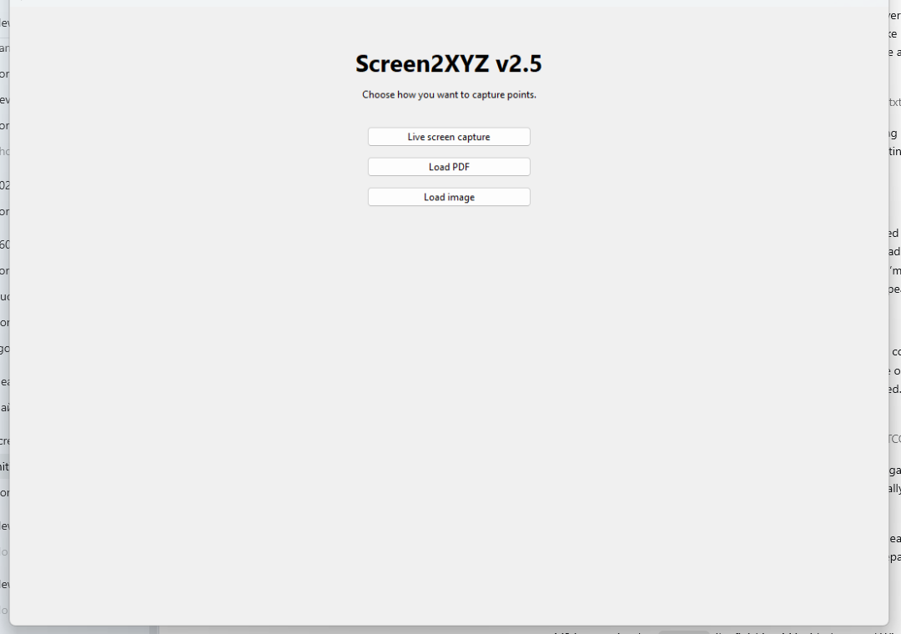
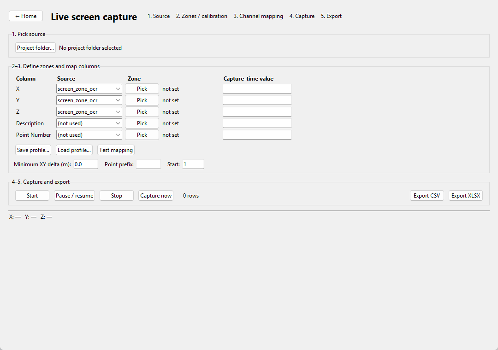
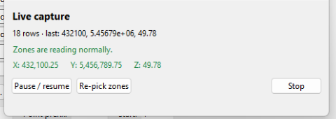
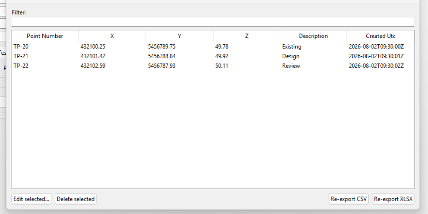
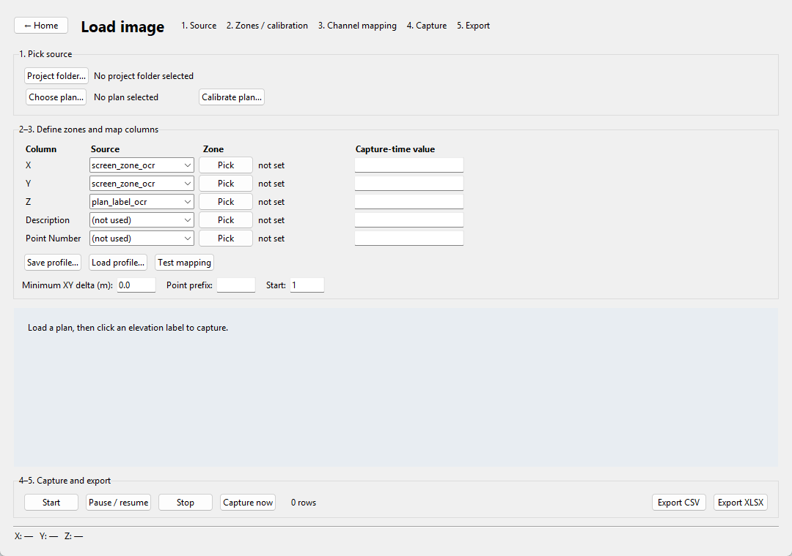

# Screen2XYZ v2.5

> **Preliminary data only.** Screen2XYZ produces conceptual estimating data, not certified survey data. Validate every output against an authoritative source before relying on it.

Screen2XYZ turns coordinate and elevation readouts already visible on your screen into reviewable X/Y/Z point rows. It is local, Windows-first, source-agnostic, and designed to be understandable in about five minutes.

## The 60-second pitch

- Choose **Live screen capture**, **Load PDF**, or **Load image**.
- Map X, Y, Z, Description, and Point number to screen OCR zones, plan clicks, plan-label OCR, the clipboard, or manual input.
- Test the mapping, then capture stable changes automatically or click labels on a plan.
- Watch the always-on-top zone-health overlay; Screen2XYZ pauses if OCR repeatedly fails or display/DPI settings change.
- Review, filter, edit, or soft-delete rows with an audit trail, then export one XLSX or CSV.

The v2.5 realistic proof drives rendered image bytes through real Tesseract OCR, parsing, stability, SQLite, and XLSX. Its current Windows result is **220/220 exact rows (100.00%)**, with **zero duplicates, zero accepted hallucinations, and exact SQLite/XLSX parity**. See [Accuracy and validation](docs/ACCURACY.md).

## See the workflow

These images are generated by the scripted Windows Tk smoke test and form a GIF-ready sequence.

| Choose a mode | Configure and test mapping |
|---|---|
|  |  |

| Monitor capture | Review before export |
|---|---|
|  |  |



## Install on Windows

For a release build, download `Screen2XYZ-v2.5.x-windows-x64.zip`, verify it against `SHA256SUMS.txt`, unzip the entire folder, and run `Screen2XYZ-Setup\Screen2XYZ.exe`. The verified local v2.5.0 bundle is 44.63 MiB uncompressed and 22.01 MiB as a ZIP; release-runner size may vary slightly.

To run from source, use Python 3.11 or newer:

```powershell
py -3.11 -m venv .venv
.\.venv\Scripts\python -m pip install --upgrade pip
.\.venv\Scripts\python -m pip install -r requirements.txt
.\run_screen2xyz.ps1
```

Optional system tools:

- [Tesseract OCR](https://tesseract-ocr.github.io/tessdoc/Installation.html): `winget install --id UB-Mannheim.TesseractOCR --exact`
- [Poppler](https://poppler.freedesktop.org/): `winget install --id oschwartz10612.Poppler --exact`

The app detects both tools. Without Tesseract on Windows, enhanced OCR is disabled and the Windows OCR fallback remains available. Without Poppler, PDF loading is disabled but image and live capture remain available. The in-app dialog includes the same install command and a clickable help link.

## Quick starts

### Estimator using a document viewer

1. Open the drawing and show its live coordinate/status readout.
2. Start **Live screen capture**, choose a project folder, and map X and Y to tight OCR zones.
3. Map Z to another screen zone, or load the plan and use `plan_label_ocr` for click-driven elevation capture.
4. Set the XY dedup distance and point-number prefix/start, then select **Test mapping**.
5. Start capture. Keep working in the viewer while the mini overlay shows live values. Stop, review, and export XLSX.

### Plan-only user

1. Choose **Load PDF** or **Load image**, then open the plan.
2. Calibrate the plan if X/Y will come from `plan_click`.
3. Map Z to `plan_label_ocr`; map any remaining columns to manual or clipboard input.
4. Test the mapping, start the session, and click the intended labels.
5. Stop, review edits/deletions, and export.

The bundled first-run guide illustrates the same five steps without requiring a network connection. Reopen it from **Help → 5-step quick start**.

## Capture controls

Global Windows hotkeys work while another application has focus:

| Action | Hotkey |
|---|---|
| Start or pause/resume | `Ctrl+Shift+F9` |
| Stop | `Ctrl+Shift+F10` |
| Force one capture attempt | `Ctrl+Shift+F11` |

Automatic capture is available when every mapped source is a screen zone or clipboard. A plan-derived channel makes the session click-driven. All retained points are journaled before SQLite insertion. Edits and soft deletions add audit records; they do not rewrite the original run journal.

## Troubleshooting

| Problem | What Screen2XYZ does | Fix |
|---|---|---|
| Poppler missing | PDF loading is disabled; no crash or traceback is shown. | Run `winget install --id oschwartz10612.Poppler --exact`, restart, or use **Load image**. |
| Tesseract missing | Enhanced OCR is disabled. Windows uses its OCR fallback; other systems cannot start OCR capture. | Run `winget install --id UB-Mannheim.TesseractOCR --exact`, then restart. |
| Zone stopped reading | After the configured consecutive-failure limit, capture pauses and marks the zone unhealthy. | Select **Re-pick zones**, redraw each zone tightly, and test again. |
| Resolution or DPI changed | Capture pauses before accepting another row. | Restore the display setup or re-pick zones at the new scale. |
| Values are skipped | They may be inside the configured minimum XY delta. | Reduce the dedup distance if the points are intentionally close. |
| A row is wrong | The session review supports audited edits and soft deletes. | Correct or remove it before re-exporting, then validate against the authoritative source. |

## FAQ

**Does Screen2XYZ control or scrape the source application?**

No. It reads only the screen rectangles, local files, clipboard, or manual values you explicitly map. It has no service-specific scraping presets.

**Does it upload plans or coordinates?**

No. Capture, OCR, journaling, SQLite storage, review, and export run locally.

**Is 100% a guarantee on my drawings?**

No. It is a reproducible result for the published synthetic-but-realistic harness. Fonts, scale, contrast, rotation, compression, and display settings affect OCR. Bad reads are designed to be rejected rather than silently stored, but every output still requires authoritative validation.

**Can I recover after a crash?**

Yes. Retained points are written journal-first and replayed into the project-local SQLite database on reopening.

**Where is project data stored?**

Under `.screen2xyz/` inside the project folder: the SQLite database, run journals, profiles, and rendered PDF pages.

**Can I build the Windows bundle myself?**

Yes. Follow [packaging/README.md](packaging/README.md). Release tags matching `v2.5.*` run the full test/proof matrix, build the folder, create a ZIP and checksum, and publish a GitHub Release.

## Development and tests

```powershell
$env:PYTHONPATH = "src"
.\.venv\Scripts\python -m unittest discover -s tests_app -t . -v
.\.venv\Scripts\python tests_civil\run_civil_tests.py
.\.venv\Scripts\python -m unittest discover -s tests_m2 -t . -v
.\.venv\Scripts\python -m tests_app.harness --output .lab_work\v2_5_harness
```

The realistic harness requires a local Tesseract executable and fails the job unless accuracy is at least 95%, false duplicates are zero, accepted hallucinations are zero, and XLSX exactly matches SQLite.

## Licence

Screen2XYZ is available under the [MIT License](LICENSE). Third-party components remain subject to their own licences; see [THIRD_PARTY_NOTICES.md](THIRD_PARTY_NOTICES.md).
